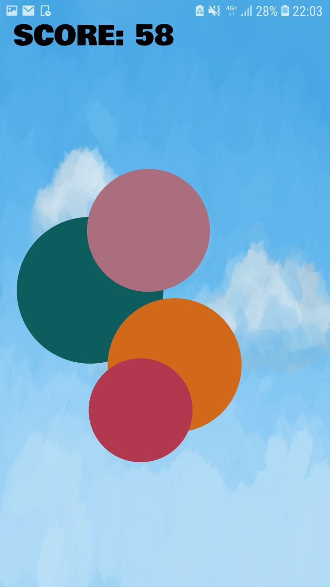

# Balloon POP

Balloon POP is a fast-paced 2D arcade game that challenges your reflexes! Tap to pop the balloons as fast as possible and survive as long as possible! You lose when the balloons expands too much and touch the border of the screen!

Home Screen                |  Play Screen              |     Losing screen
:-------------------------:|:-------------------------:|:-------------------------:
.  |  . | .

## Credits

- [luanpotter](https://github.com/luanpotter) for his guidance and patience in answering my questions.
- [ Alekhin ](https://github.com/japalekhin) for his tutorials on the [Flame] game engine.
- StackOverflow and online tutorials on Dart and Flutter
